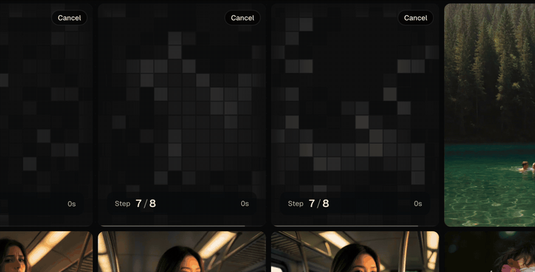

<p align="center">
  <picture>
    <source media="(prefers-color-scheme: dark)" srcset="./public/heiss-lockup-white.svg" />
    
  </picture>
</p>

<h3 align="center">ComfyUI, without the graph.</h3>

<p align="center">
  A calm, local front end for ComfyUI.<br />
  Bring your own workflows or use the built-in ones, write a prompt, and watch it render.
</p>

<p align="center">
  <a href="https://tristmeister.github.io/HEISS-UI/"><b>Website</b></a>
  &nbsp;·&nbsp;
  <a href="#quick-start">Quick start</a>
  &nbsp;·&nbsp;
  <a href="#paste-into-an-agent">Paste into an agent</a>
  &nbsp;·&nbsp;
  <a href="#bring-your-own-workflow">Your own workflows</a>
  &nbsp;·&nbsp;
  <a href="#faq">FAQ</a>
</p>

<p align="center">
  
</p>

<p align="center">
  <sub>Free and open source under MIT. Built on the great work of <a href="https://github.com/jasperdevs/J-AI-Studio">J-AI Studio</a> by Jasper. <a href="#credits">More on that below.</a></sub>
</p>

---

HEISS UI sits on top of the ComfyUI you already run. You get a prompt box, a gallery and only the settings that matter for the model you picked. ComfyUI still runs every job and stays the source of truth for your nodes, models and outputs.

The node graph is great for building workflows and less great for the everyday loop of prompt, wait, look, tweak. HEISS UI is for that loop, and your workflows come along.

## Features

- **Bring your own workflow.** Import any ComfyUI workflow (API or visual JSON) and it turns into a clean set of controls with your graph running underneath. [How it works ↓](#bring-your-own-workflow)
- **Drop in a model and go.** HEISS reads each model file to tell what it is, uses the settings its makers recommend, and pairs it with a matching text encoder and VAE. If one is missing, it says which and can download it for you.
- **Controls that fit the model.** Models, samplers, schedulers, size and prompt limits, text encoders and VAEs are read straight from ComfyUI. You only see what the selected model actually uses.
- **Watch it render.** Live previews resolve from a pixel mosaic into the final image while ComfyUI works. Queue the next one, cancel any time.
- **Image and video.** Separate galleries, plus start-image reuse wherever the workflow supports it.
- **Private Vault.** An opt-in switch per generation that encrypts the output, prompt and settings behind a password.
- **Upscale and compare.** Upscale any image in one click with SeedVR2, then drag a slider across it to see what changed.
- **LoRA stacks.** Your LoRAs, grouped by folder, stackable per generation.
- **Zen mode.** A fullscreen prompt and output view for when you don't need the panels.

<p align="center">
  <a href="./docs/screenshots/realtime-generation.mp4"></a>
</p>

## Quick start

You need **Node.js 20+** and a working **ComfyUI** install. HEISS UI looks for ComfyUI at `http://127.0.0.1:8188`.

**Easiest:** download the latest `heiss-ui-*.zip` from [Releases](https://github.com/tristmeister/HEISS-UI/releases), unpack it and double-click **Start HEISS UI** (`.command` on macOS, `.bat` on Windows), or run `npm start` in the folder. The app comes prebuilt; the first start installs its three runtime packages, about 30 MB.

**From source**, to follow `main` or change the code:

```bash
git clone https://github.com/tristmeister/HEISS-UI.git heiss-ui
cd heiss-ui
npm install
npm start
```

`npm start` builds the app the first time. Then open **http://127.0.0.1:8787**. Your models, samplers and VAEs show up on their own.

ComfyUI on another port or machine? Copy `.env.example` to `.env` and set `COMFY_URL`.

## Paste into an agent

Rather have Claude Code, Codex or another coding agent do the setup? Paste this in. It checks your setup, installs everything and confirms the app can reach ComfyUI. Model downloads only happen if you ask for them.

```text
Install and run HEISS UI from GitHub: https://github.com/tristmeister/HEISS-UI

Please do the full local setup for me:

1. Check whether Node.js 20+ is installed.
2. Check whether ComfyUI is installed and running at http://127.0.0.1:8188.
3. If ComfyUI is not running, help me start my existing ComfyUI install. Do not download models unless I explicitly ask.
4. Clone https://github.com/tristmeister/HEISS-UI into a normal projects folder.
5. Run npm install.
6. Copy .env.example to .env only if configuration changes are needed.
7. Set COMFY_URL to my ComfyUI URL, usually http://127.0.0.1:8188.
8. Run npm run build.
9. Start the app with npm start.
10. Open http://127.0.0.1:8787 and verify the app can reach ComfyUI, detect models, and load the gallery.
11. For future updates, use Settings -> Update, or run git pull, npm install, and npm run build.

Keep everything local. Do not expose HOST=0.0.0.0 unless I ask for phone or LAN access. If something fails, read the error, check ComfyUI /object_info and /system_stats, and fix the setup instead of guessing.
```

## Bring your own workflow

For anything custom, this is the way to go.

1. Build and test the graph in ComfyUI.
2. Export it in **API format**.
3. Add a `heissUi` block that maps node inputs to the controls you want:

   ```json
   {
     "heissUi": {
       "id": "my-workflow",
       "name": "My Workflow",
       "kind": "image",
       "controls": {
         "prompt": { "node": "4", "input": "text" },
         "steps": { "node": "7", "input": "steps" },
         "seed": { "node": "7", "input": "seed" }
       }
     }
   }
   ```

4. Import it in the **Workflows** panel, or drop it into the `workflows/` folder.

It shows up as soon as the nodes it needs are installed. Only the mapped inputs are touched. Everything else runs exactly as you exported it. The [workflow guide](./workflows/README.md) covers the full control list, image-to-image inputs and LoRA loaders.

## Updating

**A downloaded release** updates itself: **Settings → About → Install update** downloads the new release, checks it against its published SHA-256 and swaps it in when you press **Restart now**. Your `data` folder, `.env` and installed packages stay where they are. The previous version is kept in `.update/backup`, and if the new one does not start, HEISS UI goes back to it by itself. This needs the copy to run through its launcher (or `npm start`), and a release from 0.3.1 on; older copies need one manual download first.

**A Git checkout**: **Settings → About → Install update**, then restart the server. From the terminal:

```bash
git pull
npm install
npm run build
npm start
```

`npm run check:updates` lists outdated dependencies.

## Configuration

Copy `.env.example` to `.env` when you need different ports or paths.

```bash
COMFY_URL=http://127.0.0.1:8188
HOST=127.0.0.1
PORT=8787
HEISS_DATA_DIR=./data
COMFY_OUTPUT_DIR=
```

`COMFY_OUTPUT_DIR` is optional for the normal gallery and required for the Private Vault.

<details>
<summary><b>Private Vault</b></summary>

<br />

Set a privacy password in Settings, configure `COMFY_OUTPUT_DIR`, then use the **Private** switch next to the prompt.

HEISS UI encrypts the original, the gallery preview, the prompt, the settings and the asset key in a hidden data directory. Locked browsers only see anonymous placeholders. After you enter the password, items are decrypted and streamed with no-store cache headers. Downloading is always an explicit action.

ComfyUI necessarily writes a working file while it generates. HEISS UI encrypts and removes that file once the job completes. That keeps things out of casual view in Finder or Explorer, but it's not a forensic guarantee against an administrator, disk recovery, swap, or backups taken while a job was running.

</details>

<details>
<summary><b>Phone and LAN access</b></summary>

<br />

Set `HOST=0.0.0.0`, allow the chosen `PORT` through your firewall and open your computer's IP from another device. Only do this on a network you trust.

</details>

<details>
<summary><b>Windows shortcut</b></summary>

<br />

A shortcut that starts ComfyUI and HEISS UI if they aren't running, then opens the browser:

```powershell
$appRoot = "C:\path\to\heiss-ui"
$comfyRoot = "C:\path\to\ComfyUI"
$python = "C:\path\to\python.exe"

if (-not (Get-NetTCPConnection -LocalPort 8188 -State Listen -ErrorAction SilentlyContinue)) {
  Start-Process $python "main.py --listen 127.0.0.1 --port 8188 --disable-auto-launch" -WorkingDirectory $comfyRoot -WindowStyle Hidden
}

if (-not (Get-NetTCPConnection -LocalPort 8787 -State Listen -ErrorAction SilentlyContinue)) {
  Start-Process node "server/index.js" -WorkingDirectory $appRoot -WindowStyle Hidden
}

Start-Process "http://127.0.0.1:8787/"
```

</details>

## FAQ

**Do I still need ComfyUI?**
Yes. HEISS UI doesn't ship its own runtime or models, and it doesn't patch your ComfyUI install. It reads what ComfyUI has installed and builds its controls from that. The only files it ever adds are text encoders or VAEs you choose to download for a model, and those go into ComfyUI's own folders.

**Which models work?**
Out of the box: Krea 2, Anima, Z-Image, Flux.2 Dev and Klein, Pony V7, Chroma, Qwen-Image, HiDream, SD 3.5, Flux.1, SDXL (including NoobAI, Illustrious and Pony, plus DMD2, Hyper and Lightning merges) and SD 1.5 for images, and MiniMax H3, HunyuanVideo 1.5, Wan 2.2 and Wan 2.1 for video. Both all-in-one checkpoints and model-only files work; HEISS UI finds or offers the text encoder and VAE a file doesn't carry. GGUF and other formats that need custom loader nodes aren't supported yet. For anything else, get it running in ComfyUI first and bring it over as [your own workflow](#bring-your-own-workflow).

**Where do my images go?**
Into your normal ComfyUI output folder. Gallery metadata lives in HEISS UI's own local data folder. No account, no cloud in between.

**Why "HEISS"?**
*Heiß* is German for hot. Hence the steaming cup.

## Troubleshooting

- **No models showing up?** Make sure ComfyUI is running and `COMFY_URL` points at it.
- **A generation fails?** Check that the model works in ComfyUI itself and that any custom nodes it needs are installed.
- **No video option?** Your ComfyUI needs video generation nodes and a matching workflow.

## Development

```bash
npm install
npm run dev
```

`npm run dev` starts Vite and the local API server together. `npm test` runs the server tests. Both `npm run dev` and `npm start` repair missing runtime packages automatically, so an incomplete `node_modules` folder won't stop a normal start.

`npm run dev:demo` (or `HEISS_DEMO=1`) is for agent and UI testing without a GPU: when ComfyUI is unreachable it offers fake models and returns placeholder images. It is off otherwise, so a normal install shows ComfyUI as offline instead.

Contributions are welcome. See [CONTRIBUTING.md](./CONTRIBUTING.md), and please don't commit generated media, model files, logs or `.env` files.

## Credits

HEISS UI started as a fork of **[J-AI Studio](https://github.com/jasperdevs/J-AI-Studio)** by **[Jasper](https://github.com/jasperdevs)**. The core idea of a calm, prompt-first front end for ComfyUI, and a big part of the foundation this is built on, are his work. HEISS UI takes it in its own direction from there, with its own name, design and features.

If HEISS UI is useful to you, go give the original a star too.

Also standing on the shoulders of [ComfyUI](https://github.com/comfyanonymous/ComfyUI), which does all the heavy lifting.

The app is set in [Geist](https://vercel.com/font). The pixel wordmark on the website uses PP Neue Bit by [Pangram Pangram](https://pangrampangram.com), a commercial font that ships with the site only, not with the app.

## License

[MIT](./LICENSE). The original J-AI Studio copyright notice is kept alongside HEISS UI's, as the license asks.
