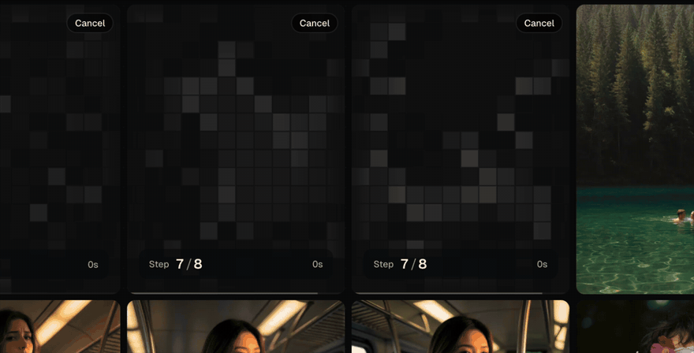

<p align="center">
  <picture>
    <source media="(prefers-color-scheme: dark)" srcset="./public/heiss-lockup-white.svg" />
    
  </picture>
</p>

<h3 align="center">ComfyUI, without the graph.</h3>

<p align="center">
  A calm, local front end for ComfyUI.<br />
  26 model families work out of the box. Bring your own workflows or use the built-in ones, write a prompt, and watch it render.
</p>

<p align="center">
  <a href="https://tristmeister.github.io/HEISS-UI/"><b>Website</b></a>
  &nbsp;·&nbsp;
  <a href="#quick-start">Quick start</a>
  &nbsp;·&nbsp;
  <a href="#supported-models">Models</a>
  &nbsp;·&nbsp;
  <a href="#bring-your-own-workflow">Your own workflows</a>
  &nbsp;·&nbsp;
  <a href="#on-your-phone">Phone</a>
  &nbsp;·&nbsp;
  <a href="#faq">FAQ</a>
</p>

<p align="center">
  
</p>

<p align="center">
  <sub>Free and open source under MIT. Built on the great work of <a href="https://github.com/jasperdevs/J-AI-Studio">J-AI Studio</a> by Jasper. <a href="#credits">More on that below.</a></sub>
</p>

---

HEISS UI sits on top of the ComfyUI you already run. You get a prompt box, a gallery and only the settings that matter for the model you picked. ComfyUI still runs every job and stays the source of truth for your nodes, models and outputs.

The node graph is great for building workflows and less great for the everyday loop of prompt, wait, look, tweak. HEISS UI is for that loop, and your workflows come along.

## Features

- **26 model families out of the box, and they look right.** 21 image and 5 video families, from SD 1.5 and SDXL to Flux.2, Qwen-Image, Krea 2, Wan 2.2 and MiniMax H3. HEISS reads each model file to tell what it is and runs it with the settings from its makers' own templates, Turbo, Lightning and base variants included. No workflow needed for good results. [The full list ↓](#supported-models)
- **Bring your own workflow.** Import any ComfyUI workflow (API or visual JSON) and it turns into a clean set of controls with your graph running underneath. [How it works ↓](#bring-your-own-workflow)
- **Missing parts download themselves.** Pick a model and HEISS checks everything it needs: text encoders, VAE, companion files and custom nodes. Anything missing gets a Download or Install button, or one **Get all**. [What it takes care of ↓](#auto-downloads)
- **Full reference image and start image support.** Edit models like Flux.2 and Qwen-Image 2.1 take reference images; every other image model takes a start image with a slider for how much it may change. [More ↓](#reference-and-start-images)
- **A phone studio.** On a phone, HEISS UI becomes its own app for your thumb: prompt, browse, share and upscale from the couch while your computer renders. [Set it up ↓](#on-your-phone)
- **LoRA stacks.** Your LoRAs, grouped by folder, stackable per generation, with stacks saved per model family.
- **Hidden.** A locked place for the images you keep to yourself: generate into it or hide anything later, unlock with Touch ID, Windows Hello or a password, and upscale, compare and remix inside it. [More ↓](#hidden)
- **Upscale and compare.** Upscale any image in one click with SeedVR2, with an optional face detail pass, then drag a slider across it to see what changed.
- **Watch it render.** Live previews resolve from a pixel mosaic into the final image while ComfyUI works, with a countdown to done. Queue the next one, cancel any time.
- **Controls that fit the model.** Models, samplers, schedulers, size and prompt limits, text encoders and VAEs are read straight from ComfyUI. You only see what the selected model actually uses.
- **Zen mode.** A fullscreen prompt and output view for when you don't need the panels.
- **Find it again.** Press ↑ in an empty prompt for your recent prompts (star the ones to keep), `/` to search the gallery by prompt, model or LoRA, and star images to keep them one tap away. Earlier images from other folders (old ComfyUI outputs, AUTOMATIC1111, Forge) join the gallery where they are, from Settings › Library. Prompts from Hidden are never kept.
- **Civitai-ready images (beta).** Switched on in Settings › Library, new PNGs also carry the prompt, LoRAs and settings the way AUTOMATIC1111 writes them, so Civitai fills in an upload.

<p align="center">
  <a href="./docs/screenshots/realtime-generation.mp4"></a>
</p>

## Quick start

You need a working **ComfyUI** install, and on macOS, Linux or from source **Node.js 20.9+** (22 LTS or newer recommended). The Windows download brings its own Node.js. HEISS UI looks for ComfyUI at `http://127.0.0.1:8188`.

**Easiest:** download the zip for your system from [Releases](https://github.com/tristmeister/HEISS-UI/releases) (`heiss-ui-*-windows-x64.zip`, `-macos-arm64` or `-linux-x64`), unpack it and double-click **Start HEISS UI** (`.bat` on Windows, `.command` on macOS, `.sh` on Linux), or run `npm start` in the folder. Its packages are inside, and the Windows zip brings Node.js too, so on Windows there is nothing else to install; on macOS and Linux, install Node.js first. The plain `heiss-ui-*.zip` (no system in its name) is what installed copies download to update themselves; you don't need it.

On macOS, the first time you open `Start HEISS UI.command` macOS may say it can’t check the file: right-click it › **Open**, then **Open** again (or allow it under System Settings › Privacy & Security). It needs Node.js 20.9 or newer.

On Windows, unpack with **Extract All** first; the launcher does not run from inside the zip. If Windows asks whether to run a downloaded file, right-click the zip › Properties › **Unblock** before unpacking. A plain folder such as `C:\HEISS-UI` works better than a Desktop or Documents folder synced by OneDrive, which can lock files during installs and updates.

**From source**, to follow `main` or change the code:

```bash
git clone https://github.com/tristmeister/HEISS-UI.git heiss-ui
cd heiss-ui
npm install
npm start
```

`npm start` builds the app the first time. Then open **http://localhost:8787**. Your models, samplers and VAEs show up on their own.

ComfyUI on another port or machine? Copy `.env.example` to `.env` and set `COMFY_URL`.

### Paste into an agent

Rather have Claude Code, Codex or another coding agent do the setup? Paste this in. It checks your setup, installs everything and confirms the app can reach ComfyUI. Model downloads only happen if you ask for them.

```text
Install and run HEISS UI from GitHub: https://github.com/tristmeister/HEISS-UI

Please do the full local setup for me:

1. Check whether Node.js 20.9+ is installed (22 LTS recommended).
2. Check whether ComfyUI is installed and running at http://127.0.0.1:8188.
3. If ComfyUI is not running, help me start my existing ComfyUI install. Do not download models unless I explicitly ask.
4. Clone https://github.com/tristmeister/HEISS-UI into a normal projects folder.
5. Run npm install.
6. Copy .env.example to .env only if configuration changes are needed.
7. Set COMFY_URL to my ComfyUI URL, usually http://127.0.0.1:8188.
8. Run npm run build.
9. Start the app with npm start.
10. Open http://localhost:8787 and verify the app can reach ComfyUI, detect models, and load the gallery.
11. For future updates, use Settings -> Update, or run git pull, npm install, and npm run build.

Keep everything local. Do not expose HOST=0.0.0.0 unless I ask for phone or LAN access. If something fails, read the error, check ComfyUI /object_info and /system_stats, and fix the setup instead of guessing.
```

## Supported models

Drop a model file into ComfyUI and HEISS UI recognises it from its weights, not just its name. Each family runs with the sampler, scheduler, steps, CFG, shift and resolution from its official ComfyUI templates and model cards, so a fresh install makes good images before you touch a setting.

| | Families |
| --- | --- |
| **Image** | Ideogram 4, Krea 2 (Turbo, Raw), MageFlow, ERNIE-Image, Anima, Z-Image (Turbo, Base), Lumina Image 2.0 (including Neta Lumina and NetaYume), Sana (1.5, Sprint, 2K/4K), Flux.2 Dev, Flux.2 Klein 4B and 9B, Pony V7, Chroma, Qwen-Image (including 2512) and Qwen-Image 2.1, HiDream I1, SD 3.5, Flux.1 (Dev, Schnell, de-distilled), SDXL (NoobAI, Illustrious, Pony, v-prediction, DMD2, Hyper, Lightning, Turbo), SD 2.x and SD 1.5 |
| **Video** | MiniMax H3, HunyuanVideo 1.5, Wan 2.2 5B, Wan 2.2 14B (high and low-noise pair) and Wan 2.1 |

Both all-in-one checkpoints and model-only files work. HEISS UI sees which parts a file carries and fills the rest from compatible files you already have, or offers to download them. A file it can't identify can be assigned by hand under **Use as** in Settings. GGUF and other formats that need custom loader nodes aren't supported yet. For anything else, get it running in ComfyUI first and bring it over as [your own workflow](#bring-your-own-workflow).

Adding a family is mostly data, not code. [MODELS.md](./MODELS.md) walks through it.

## Bring your own workflow

The built-in models cover the everyday loop. For anything custom, bring your graph.

1. Build and test the graph in ComfyUI.
2. Export it in **API format**.
3. Add a `heissUi` block that maps node inputs to the controls you want:

   ```json
   {
     "heissUi": {
       "id": "my-workflow",
       "name": "My Workflow",
       "kind": "image",
       "controls": {
         "prompt": { "node": "4", "input": "text" },
         "steps": { "node": "7", "input": "steps" },
         "seed": { "node": "7", "input": "seed" }
       }
     }
   }
   ```

4. Import it in the **Workflows** panel, or drop it into the `workflows/` folder.

It shows up as soon as the nodes it needs are installed. Only the mapped inputs are touched. Everything else runs exactly as you exported it. If the workflow uses a model file HEISS UI knows and you don't have, it offers the download; otherwise it says which folder the file belongs in. The [workflow guide](./workflows/README.md) covers the full control list, image-to-image inputs and LoRA loaders.

## Auto-downloads

Getting a new model running in ComfyUI usually means hunting for the right text encoder, the right VAE and a custom node pack or two. HEISS UI does that part for you.

- **It knows what each model needs.** Pick a model and HEISS lists exactly what's missing: a text encoder, a VAE, a companion file (like Wan 2.2's low-noise half), a custom node pack, or a newer ComfyUI. The model menu says what each model lacks, and a blocked Generate opens that model's setup.
- **One click per part, or Get all.** Files come from Hugging Face straight into the folders ComfyUI actually reads from, including shared folders set up in `extra_model_paths.yaml`. **Get all** adds up the real sizes first. Where an abliterated text encoder exists, it's the one offered.
- **Custom nodes install themselves too.** Packs listed in ComfyUI-Manager install through it; otherwise, with ComfyUI on this computer, HEISS clones the pack and installs its requirements with ComfyUI's own Python. The manual steps stay one tap away.
- **Downloads you can trust.** They show progress, speed and time left, resume after a restart, retry a dropped connection by themselves, check free space first, and send gated files to their Hugging Face page instead of failing.
- **It ends in "ready".** Each part is ticked off as it lands, and the last one turns the panel into "Krea 2 is ready". Restarting ComfyUI halfway keeps your progress.

Nothing downloads until you press the button.

## Reference and start images

- **Reference images for edit models.** Flux.2 (Klein 4B, Klein 9B and Dev) and Qwen-Image 2.1 edit from reference images the way ComfyUI's own edit templates do. The composer offers one reference slot after another as you fill them; the first reference frames the result.
- **Start images for everything else.** Every other built-in image model (Krea 2, SDXL, Flux, Z-Image and the rest) offers **Add start image**, with a Change slider for how far it may move from it.
- **A reference library in the composer.** Pick from your uploads or your own generations, drop files in, or send any image from the viewer. An upscaled image is used upscaled.
- **Your workflows too.** Imported workflows can take reference images and let one set the output size and aspect.

## On your phone

HEISS UI has a phone studio of its own, laid out for your thumb: the gallery edge to edge, one **Describe…** pill that opens the prompt, reference image, workflow, shape and number of images, and Advanced one link away. Long press a tile to Share, Upscale, Make another, Hide or Delete. Share hands the file to the phone's share sheet. Added to the home screen it opens full-screen, with haptics where the phone allows them. A ring around Generate shows progress while you browse.

To use it, turn on **Settings › Connection › Open on other devices**. HEISS UI restarts listening on your network and lists every address to open from the phone. Phones sign in with your Hidden password, so set up Hidden first. For a single run, start it with `npm start -- --lan` (or `npm run dev:lan` in a checkout) instead. The first time, your system may ask whether Node.js may accept connections; allow it for private networks. Only do this on a network you trust.

Looking after the computer stays at the computer: model downloads, node installs, updates, restarts and deleting everything are refused from other devices, and the phone hides them. The share sheet needs HTTPS; without it, Share saves the file instead. "Use the full studio" in More switches to the complete layout, and `?phone=1` shows the phone studio on any screen.

## Hidden

Hidden is a place for the images you would rather keep to yourself. Open it from the lock in the dock; the first time, it walks you through a password and, where the browser supports it, Touch ID or Windows Hello.

- **Generate straight into it.** Anything you make while Hidden is open renders there, with the same live previews, and never lands in the gallery.
- **Hide anything, any time.** The eye on a tile (or in the viewer) moves an image into Hidden, or back out.
- **Everything still works.** Upscale, compare, remix, reuse as a reference and video all work inside Hidden, and what you make from a Hidden image stays hidden.
- **Locked means nothing shows.** Not a thumbnail, not a count. It locks itself after a while untouched (Settings › Hidden), or right away with **Lock**.

<details>
<summary><b>How Hidden keeps things private</b></summary>

<br />

Each image, its prompt, settings and upscale are encrypted with AES-256-GCM under a random key, in a hidden data folder. That key is wrapped by your password (scrypt) and by each passkey through the WebAuthn PRF extension, so Touch ID and Windows Hello really are keys, not a yes/no in front of one. The normal gallery is not affected by any of this, locked or not.

Passkeys need the page at `localhost` (not `127.0.0.1`) or over HTTPS, and a browser with PRF support (current Chrome, Edge and Safari). Everywhere else, the password works.

ComfyUI necessarily writes a working file while it renders. HEISS encrypts it and removes it when the run finishes, along with the run's entry in ComfyUI's history and any image it was handed. That needs ComfyUI's output folder, which HEISS finds by itself or asks for. It keeps things out of casual view, but it is not a forensic guarantee against an administrator, disk recovery, swap, or backups taken while a job was running.

There is no password reset. If the password and every passkey are lost, **Erase Hidden** in Settings is the only way to start over, and it takes everything in Hidden with it.

</details>

## Updating

**A downloaded release** updates itself: **Settings → About → Install update** downloads the new release, checks it against its published SHA-256 and swaps it in when you press **Restart now**. Your `data` folder, `.env` and installed packages stay where they are. The previous version is kept in `.update/backup`, and if the new one does not start, HEISS UI goes back to it by itself. This needs the copy to run through its launcher (or `npm start`), and a release from 0.3.1 on; older copies need one manual download first.

A downloaded release also looks for a new version on its own, every few hours, and offers it once in a small pill at the top: **Update**, then **Restart**. It only asks GitHub which version is the latest, says nothing when you're offline, and **Settings → About → Check automatically** turns it off. Your choice and any "Later" are kept in `data/updates.json`.

**A Git checkout**: **Settings → About → Install update**, then restart the server. From the terminal:

```bash
git pull
npm install
npm run build
npm start
```

`npm run check:updates` lists outdated dependencies.

## Configuration

Copy `.env.example` to `.env` when you need different ports or paths.

```bash
COMFY_URL=http://127.0.0.1:8188
HOST=127.0.0.1
PORT=8787
HEISS_DATA_DIR=./data
COMFY_OUTPUT_DIR=
```

`COMFY_OUTPUT_DIR` is optional; HEISS UI usually finds the folder. It lets HEISS delete files with their cards and remove ComfyUI's copies of what goes into Hidden.

<details>
<summary><b>Windows shortcut</b></summary>

<br />

A shortcut that starts ComfyUI and HEISS UI if they aren't running, then opens the browser. It starts HEISS through `scripts/start.mjs`, like the launcher does, so in-app updates keep working:

```powershell
$appRoot = "C:\path\to\heiss-ui"
$comfyRoot = "C:\path\to\ComfyUI"
$python = "C:\path\to\python.exe"

if (-not (Get-NetTCPConnection -LocalPort 8188 -State Listen -ErrorAction SilentlyContinue)) {
  Start-Process $python "main.py --listen 127.0.0.1 --port 8188 --disable-auto-launch" -WorkingDirectory $comfyRoot -WindowStyle Hidden
}

if (-not (Get-NetTCPConnection -LocalPort 8787 -State Listen -ErrorAction SilentlyContinue)) {
  Start-Process node "scripts/start.mjs" -WorkingDirectory $appRoot -WindowStyle Hidden
}

Start-Process "http://localhost:8787/"
```

</details>

## FAQ

**Do I still need ComfyUI?**
Yes. HEISS UI doesn't ship its own runtime or models, and it doesn't patch your ComfyUI install. It reads what ComfyUI has installed and builds its controls from that. The only things it ever adds are files and node packs you choose to download for a model, and those go into ComfyUI's own folders.

**Which models work?**
26 families out of the box, 21 for images and 5 for video. See [Supported models](#supported-models). Anything else runs as [your own workflow](#bring-your-own-workflow).

**Where do my images go?**
Into your normal ComfyUI output folder. Gallery metadata lives in HEISS UI's own local data folder. No account, no cloud in between.

**Why "HEISS"?**
*Heiß* is German for hot. Hence the steaming cup.

## Troubleshooting

- **No models showing up?** Make sure ComfyUI is running and `COMFY_URL` points at it.
- **A generation fails?** Check that the model works in ComfyUI itself and that any custom nodes it needs are installed.
- **No video option?** Your ComfyUI needs video generation nodes and a matching workflow.

## Development

```bash
npm install
npm run dev
```

`npm run dev` starts Vite and the local API server together. `npm test` runs the server tests. Both `npm run dev` and `npm start` repair missing runtime packages automatically, so an incomplete `node_modules` folder won't stop a normal start.

`npm run dev:demo` (or `HEISS_DEMO=1`) is for agent and UI testing without a GPU: when ComfyUI is unreachable it offers fake models and returns placeholder images. It is off otherwise, so a normal install shows ComfyUI as offline instead.

Contributions are welcome. See [CONTRIBUTING.md](./CONTRIBUTING.md), and please don't commit generated media, model files, logs or `.env` files.

## Credits

HEISS UI started as a fork of **[J-AI Studio](https://github.com/jasperdevs/J-AI-Studio)** by **[Jasper](https://github.com/jasperdevs)**. The core idea of a calm, prompt-first front end for ComfyUI, and a big part of the foundation this is built on, are his work. HEISS UI takes it in its own direction from there, with its own name, design and features.

If HEISS UI is useful to you, go give the original a star too.

Also standing on the shoulders of [ComfyUI](https://github.com/comfyanonymous/ComfyUI), which does all the heavy lifting.

The app is set in [Geist](https://vercel.com/font). The pixel wordmark on the website uses PP Neue Bit by [Pangram Pangram](https://pangrampangram.com), a commercial font that ships with the site only, not with the app.

## License

[MIT](./LICENSE). The original J-AI Studio copyright notice is kept alongside HEISS UI's, as the license asks.
